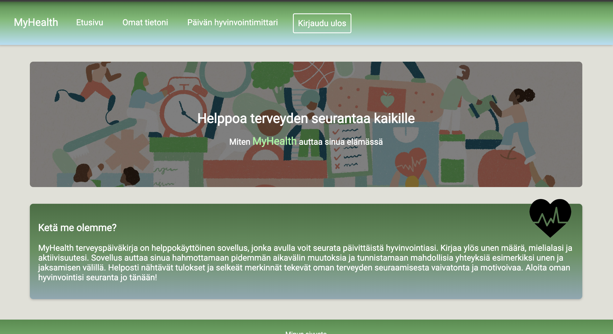
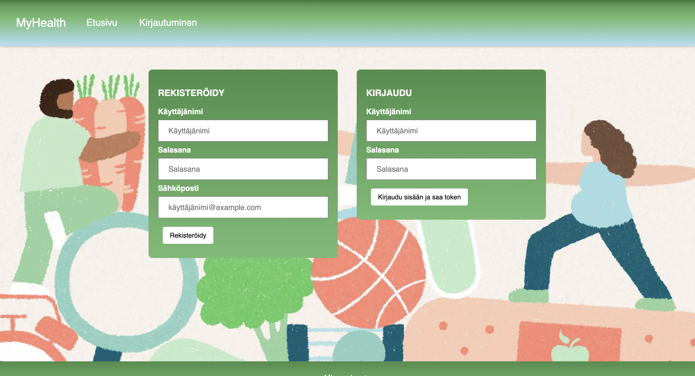
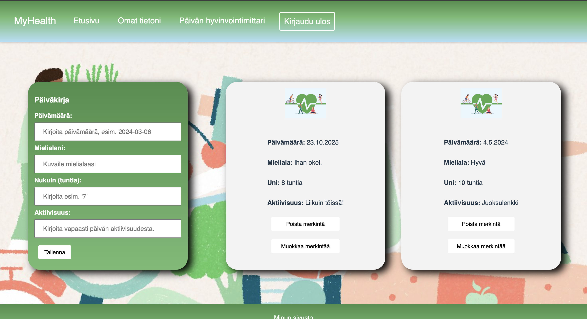
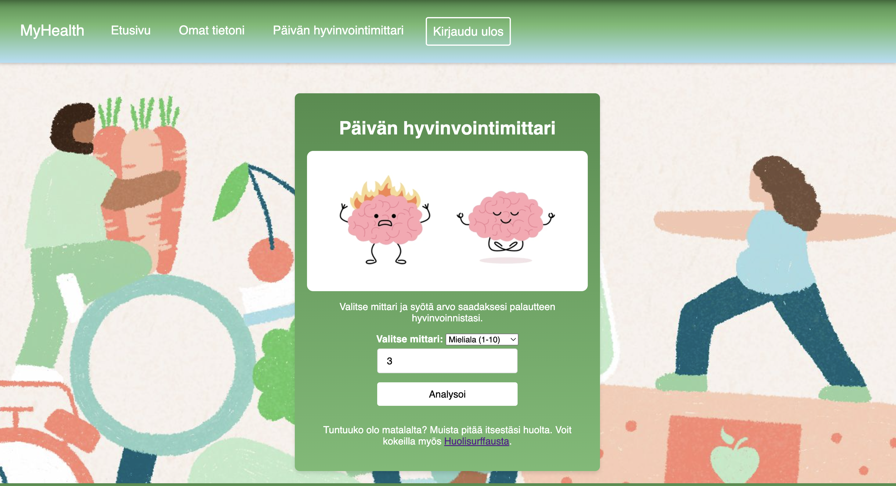
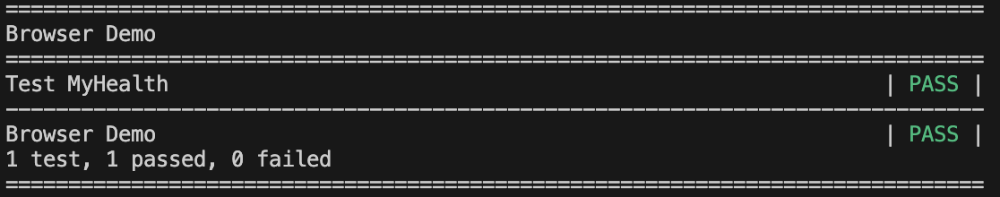
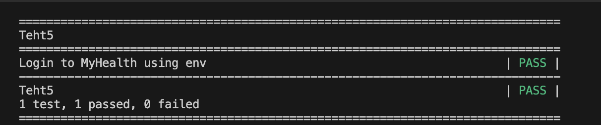
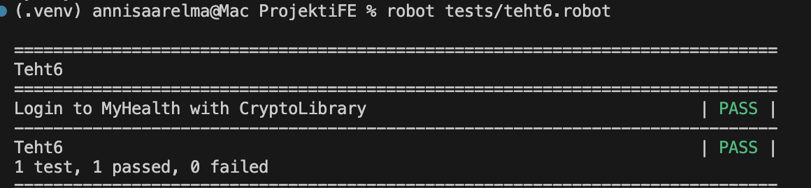
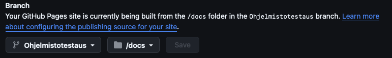

# MyHealth frontend

[Siirry kohtaan "Ohjelmistotestaus - yksilötehtävät"](#ohjelmistotestaus---yksilötehtävät)

## Yleiskuvaus sovelluksesta

MyHealth on päiväkirjamainen sovellus, joka mahdollistaa käyttäjän päivittäisten merkintöjen tallentamisen,
muokkaamisen ja tarvittaessa poistamisen. Sovellus hyödyntää Node.js ja Express.js - pohjaista REST API:a, joka kommunikoi MySql- tietokannan kanssa. 
Käyttäjäautentikointi on toteutettu JWT-Tokenin avulla.

---

## Projektin rakenne
```

ProjektiFE/
│── index.html   # Pääsivu
│── public/
│   ├── img/       # Kuvakansio
│   │   ├── brain.jpeg
│   │   ├── diary.jpg
│   │   ├── Heart_logo.png
│   │   ├── hero_image.jpg
│   │   ├── Index.png
│   │   ├── Kirjautuminen.png
│   │   ├── OmatTiedot.png
│   │   ├── Päivänhyvinvointimittari.png
│── src/
│   ├── css/       # Tyylitiedostot
│   │   ├── analysis.css
│   │   ├── meistä.css
│   │   ├── modal.css
│   │   ├── style.css
│   ├── js/        # JavaScript-tiedostot
│   │   ├── analysis.js
│   │   ├── auth.js
│   │   ├── diary.js
│   │   ├── entries.js
│   │   ├── fetch.js
│   │   ├── main.js
│   │   ├── users.js
│   ├── pages/     # HTML-sivut
│   │   ├── Analyysi.html
│   │   ├── Kirjaudu.html
│   │   ├── OmatTiedot.html
│── favicon.ico  # Sovelluksen ikoni
│── package-lock.json
│── package.json
│── README.md
```
---
## Kuvia käyttöliittymästä


**Etusivu**


**Kirjautuminen**


**Omien merkintöjen tarkastelu ja lisääminen**


**Päivän hyvinvointimittari**


## Muuta  
Frontend on rakennettu seuraavilla teknologioilla:  
- **JavaScript**  
- **HTML**  
- **CSS**  
- **Node.js & Express.js** (taustajärjestelmä)
- **MySQL** (tietokanta)  
- **JWT (JSON Web Token)** käyttäjäautentikointiin

---
# Ohjelmistotestaus - yksilötehtävät  

## Tehtävä 1.

Tässä tehtävässä piti ladata Robot Framework ja siihen vaadittavat kirjastot:

- Robot Framework

- Browser Library

- Requests library

- CryptoLibrary

- Robotidy

  ______________________

Koodit latauksia varten terminaalissa:


Minulla oli Robot Framework jo asennettuna, mutta se on asennettu terminalissa komennolla:


````
pip3 install robotframework
````


Kirjastojen lataaminen virtuaalikoneessa: 


````
pip install robotframework robotframework-browser robotframework-requests robotframework-crypto
````

__________
  

Sitten tarkistin että kaikki tarvittavat kirjastot löytyy:


````
pip list
````

Kloonattava asennustesti.py ei toiminut, joten ajoin tiedoston terminalin kautta:

````
python3 -u ".../Webkehitys/ProjektiFE/asennustesti.py"
````
Tästä tulostui:

````
Robot Framework: 7.2.2
Browser: 19.4.0
requests: 2.32.3
CryptoLibrary: 0.4.2
````

__________

## Tehtävä 2.

Tässä tehtävässä sovellettiin tunnilla annettua kirjautumisesimerkkiä ja sovellettiin sitä oman sovelluksen kirjautumiseen.
Ensin lisäsin kaksi tiedostoa Tests/ kansioon: 

1. browser_demo.robot- tiedostoon laitoin seuraavat tiedot:

````
*** Settings ***
Library     Browser    auto_closing_level=KEEP
Resource    Keywords.robot  

*** Test Cases ***
Test MyHealth
    New Browser    chromium    headless=No  
    New Page       http://localhost:5173/src/pages/Kirjaudu.html 
    Get Title      ==    Kirjautuminen
    Type Text    css=.loginForm input[type="text"]    ${Username}    delay=0.1 s
    Type Secret  css=.loginForm input[type="password"]    $Password   delay=0.1 s
    Click    css=.loginForm button
````
__________

 2. Keywords.robot- tiedostoon lisäsin testikäyttäjätunnukset:

 ````
*** Variables ***
${Username}     ansku
${Password}     anskubansku
````
Tämän jälkeen ajoin browser_demo.robot- tiedoston terminalissa komennolla: 
````
robot tests/browser_demo.robot
````
Onnistunut lopputulos terminalissa:

**Onnistunut kirjautuminen**


## Tehtävä 5.

Tässä tehtävässä oli tarkoitus tehdä kirjautumistesti omalle Myhealth-sovellukselle, joka käyttää ’.env’-tiedostoon piilotettua käyttäjätunnusta ja salasanaa.

1. Luodaan .env tiedosto

````
*** Example  of env. file ***
USERNAME=Oma käyttäjänimi tähän 
PASSWORD=Oma salasana tähän 
````
__________

2. Määritellään muuttujat load_env.py tiedostoon:

````
import os
from dotenv import load_dotenv

load_dotenv()
print(os.getenv("USERNAME"))
print(os.getenv("PASSWORD"))

````
__________

3. Tehdään kirjautumistesti:

````
*** Settings ***
Library    Browser    auto_closing_level=KEEP
Library           Collections
Library           OperatingSystem
Library           DotenvLibrary
Variables         load_env.py


*** Test Cases ***
Login to MyHealth using env

    New Browser    chromium    headless=No
    New Page    http://localhost:5173/src/pages/Kirjaudu.html
    Get Title      ==    Kirjautuminen

    ${USERNAME}=    Get Environment Variable    USERNAME
    ${PASSWORD}=    Get Environment Variable    PASSWORD

    Log    USERNAME: ${USERNAME}
    Log    PASSWORD: 

    Type Text    css=.loginForm input[type="text"]    ${Username}    delay=0.1 s
    Type Secret  css=.loginForm input[type="password"]    $Password   delay=0.1 s
    Click    css=.loginForm button

````
__________

**Onnistunut lopputulos terminalissa:**




## Tehtävä 6

Tässä tehtävässä oli tarkoitus tehdä kirjautumistesti käyttäen Cryptolibrarya.

1. Teht6.robot tiedoston koodi:
````
*** Settings ***
Library     Browser      auto_closing_level=SUITE
Library     CryptoLibrary     variable_decryption=True

*** Variables ***
${Username}    crypt:ZKqJyjDiGorvMd/rrQzYVco5ocTU028EwoPWoznt7FoQR2xt9b/4AlhPB+4QxhMw71CMfOQ=
${Password}    crypt:Pv/puBot7UQHGVh8uMocgg1nx783P3NDrGsAn2GR5WvWofFqx/t26mThwj39Q1mTVuy7la7S/VpLerM=

*** Test Cases ***
Login to MyHealth with CryptoLibrary

    New Browser     chromium    headless=No
    New Page        http://localhost:5173/src/pages/Kirjaudu.html
    Get Title       ==    Kirjautuminen

    Type Text       css=.loginForm input[type="text"]        ${Username}    delay=0.1s
    Type Secret     css=.loginForm input[type="password"]    $Password   delay=0.1s
    Click           css=.loginForm button
  ````
__________

**Onnistunut lopputulos terminaalissa:**



## Tehtävä 7

Tässä tehtävässä oli tarkoitus ohjata testien tulokset ja raportit /outputs - nimiseen kansioon.
Loin outputs- kansion projektiin, johon ohjasin testien raportit ja tulokset käyttäen toimintoa:
````
robot --outputdir Outputs tests/valittu testi.robot 
````

## Tehtävä 8

Tässä tehtävässä oli tarkoitus luoda omalle Github - projektille oma Github.io sivusto, jonka kautta testit (raportit ja tulokset) ovat luettavissa.

1. Ensin loin projektin juureen /docs - kansion.
__________

2. Seuraavaksi kopioin log.html ja reports.html Outputs- kansioon näillä komennoilla:
````
cp Outputs/log.html docs/
cp Outputs/report.html docs/
````
Tein myös index.md sivun
__________

3. Tämän jälkeen siirryin oman Github-repositorini sivulle selaimessa ja suoritin seuraavat vaiheet:

1. Settings --> Pages
2. Valitsin Source, josta valitsin branchin ja docs kansion:

3. Lopuksi painoin **Save**.

__________

4. Lopulta sain oman github.io linkin "https://annivs.github.io/Web-kehitys-Projekti-FE/"

